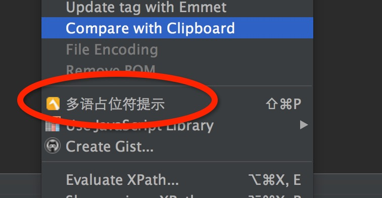
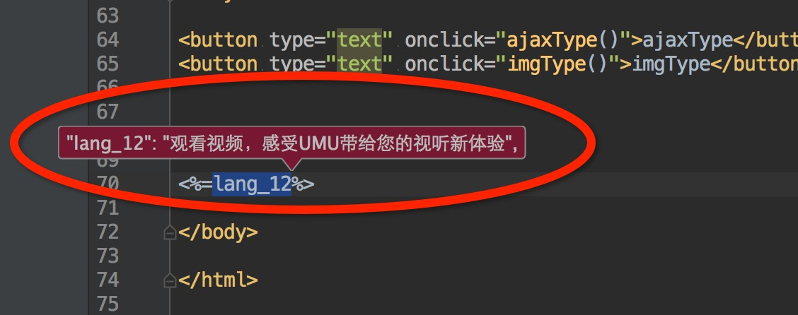

webstorm-umu-lang-tip-extension
==============

umu提示多语言工具，针对多语言的占位符给出中文的多语

## How to install it

* Webstorm -> setting -> Plugins -> Click on Browse repositories -> Search for `webstorm-umu-lang-tip-extension` and install,注意在是对应目录的output的jar包
* Restart your IDE

## How to use it

* 双击选中你想查看中文的语言占位符 `<%=lang_20001%>` 中的词条编号 `lang_20001`
* 快捷键 shift+cmd+p
* 右键菜单

## 插件的开发

- 安装intelliJ IDEA
- 新建 project - IntelliJ Platform Plugin
- 完成新建项目后，设置 Project Structure 中的Artisacts 为empty的jar包
- 后面写代码，build jar吧
- 安装使用
